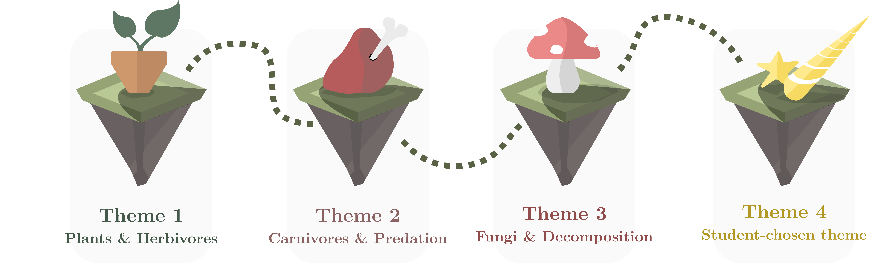

    

# Circle of Life project

- [Table of Contents](#table-of-contents)
- [Purpose](#purpose)
- [Project Description](#project-description)
    - [Requirements](#requirements)
    - [Project Description](#project-description)
- [Rules](#rules)
    - [Submission](#submission)
    - [Groups](#groups)
    - [Programming Language](#programming-language)
    - [Video Demo](#video-demo)
    - [Report](#report)
    - [Cheating](#cheating)
- [Project Materials](#project-materials)
- [Good Advice](#good-advice)
    - [Divide and Conquer](#divide-and-conquer)
    - [Start Simple](#start-simple)
    - [Don't Treat the Report as an Afterthought](#dont-treat-the-report-as-an-afterthought)
    - [Don't Treat Tests as an Afterthought](#dont-treat-tests-as-an-afterthought)
    - [Test Incrementally](#test-incrementally)
    - [Before Submission](#before-submission)

# Purpose
In this project, you will implement a simulation of life. Each week, you will be introduced to a new theme with corresponding requirements and input files, which build upon your previous solution by constructing new elements for the simulation and modifying existing parts.
The project consists of analyzing the requirements specification (domain analysis) and then designing and implementing a program that can simulate different forms of life and their interaction as described in various requirements and input files. In your solution, you should use basic Java constructs such as classes, methods, interfaces, abstract classes, loops, Collections, etc. Your implementation should be documented using Java's documentation facilities. You should also argue for the correctness of your program through systematic testing.
You must prepare a report in which you present and argue for your design and implementation choices, as well as explain whether the program works as expected, and assess to what extent your testing of the program supports this conclusion.
The project involves overall development, testing, and documentation of a Java program, as well as two academic reports describing your considerations, choices, and decisions.

# Project Description
This project involves simulating a "mini-world" consisting of animals, plants, and other actors. Each week focuses on a new theme that continuously builds on the interaction between the different types of actors that exist in our "mini-world". The simulation uses our project library (ITUmulator), which is described below and in the separate file ITU Simulator - Library Description. By using this library, you will, over the coming weeks, build a visual simulation where you will be able to see the different actors living their best lives, competing for food, and evolving through the simulation. You could say it's a whole life cycle.

The themes are as follows:
- Week 1: Primitive life: Herbivores and Plants
- Week 2: Food chains: Predators, herd animals, and territories
- Week 3: Decomposition: The Fungal Kingdom
- Week 4: Implementation of optional animal

For each theme, there is a description of the requirements that the solution must support. For each theme, there will also be some associated input files that you must load and use to populate different simulations. You can also write more input files yourself. You will have the opportunity to determine how the different actors are displayed in the simulation. Here we refer again to the file describing the project library.

## Requirements
The requirements for your system are that it must:
- **R1**) Meet the individual requirements set out in each theme's description. However, the requirements are formulated as being open, and it is therefore up to you as a group to determine exactly what they mean and how you interpret them. You support that you meet the requirements through your tests (as taught in the course).
- **R2**) Ensure that your implementation is documented using Java documentation.
- **R3**) Be able to load an input file from any theme and still function correctly.
- **R4**) Have a modular design that makes it easy to add new extensions (we build this gradually throughout the different themes).
- **R5**) The submitted project can be compiled and run on other computers.

## Project Library

The project includes a Java library, which has accompanying Java documentation and is commented. This library has three purposes:
- **P1**) It can visualize our program via Java Swing (see the video lecture on Swing if you're curious about how to build user interfaces).
- **P2**) It exposes the functionality to run a simulation.
- **P3**) It exposes the abstraction of a 'map' which will be the foundation for our system.
It is not expected that you understand all the code in this library, only enough to be able to interact programmatically with the map and use the simulation. To learn how to get started with this, see the accompanying file ITU Simulator - Library Description. This library should not be edited during the project.

# Rules
## Submission
The assignment will be reviewed at the lecture on 23/11, and the reports, code, and video demo must be submitted no later than 21/12 at 14:00 through LearnIT (under exam submission & groups).
It is your responsibility to submit on time. If you submit late, you cannot take the exam! There is no flexibility from ITU's side, and it's not something we - as teachers - can do anything about.
You should therefore make sure to review and upload reports and code files, etc. in good time to ensure correct and timely submission. When submitting on LearnIT, you need to click 'next' several times to confirm that you are submitting your exam project (until you have received a confirmation email). Do not start the submission at 13:58.
When submitting the project, please create a zip file with the following structure and naming:
- **S1**) [groupname-projectreport.pdf]
- **S2**) [groupname-projectdiary.pdf]
- **S3**) [groupname-demo] (Any video format that can be played on Mac and Windows or a link to the video demo)
- **S4**) program (a folder containing all your code, images, library. Make sure it compiles)

## Groups
The groups (of a size of three students per group) are formed by you as a starting point and must be formed before the project start (See teaching sessions 21 and 22). If there are challenges regarding groups, please contact Sebastian.

## Programming Language
The system must be developed in Java and use the provided library. You may use a development environment other than BlueJ (e.g., IntelliJ), but it is your responsibility to know how to use it. We provide the project for both BlueJ, IntelliJ, and VSCode.

## Video Demo
The video demo should basically show that your program runs, possibly with different input files. You are welcome to talk over and "present" your solution if you think there is something relevant to tell. The video may be a maximum of 5 minutes, which should be ample time to show it. It is not intended that you introduce the code or similar here.

## Report
In the project, you are expected to prepare two reports: The project report and the project diary. The project report has a scope of maximum 6 standard pages (excl. Figures, front page, and table of contents). The project diary has a maximum scope of 8 standard pages. A page is 2400 characters including spaces. You can get more help with both reports in the document Formulation of the Report. It is also expected that your program is documented using Java documentation.

Both the project report and the project diary are written collectively in the group. The latest version of the project diary should be sent to your TA no later than the Sunday before the next guidance session.

The report must be written in either Danish or English.

The front page must meet ITU's requirements for an exam report (https://itustudent.itu.dk/Study-Administration/Exams/Submitting-written-work).

## Cheating
You may not use others' text, illustrations, or program code without explicit source citation. Plagiarism can result in exclusion from the exam (and potentially expulsion from the university)!

# Project Materials
In connection with the project, you will receive the following material:
- **M1**) This project description.
- **M2**) "Formulation of the report".
- **M3**) "WorldSimulator" – description of library and Java documentation.
- **M4**) Base project (with project library).
- **M5**) Themes for the four weeks (they are available from each Sunday), which contain both input files and a description of the theme and associated requirements (document).

# Evaluation
The main emphasis in the evaluation is placed on the project report. The purpose of the report is to make explicit the decisions you make along the way, and to show that you can reflect on different possibilities in relation to both design and implementation of a larger program. It is thus important that you justify your design choices and assess the degree of completion of the product. (The code is of course a necessary prerequisite for the project report.)
The following sections must be in the project report:
- **A1**) "Introduction" containing a specification and delimitation of what your system supports based on the requirements set by the individual themes.
- **A2**) "Design" containing justified design decisions in the solution domain regarding the system (classes, interfaces, etc. and relationships between these). This includes your entire system from data loading to the simulation is complete. You should not describe the accompanying library.
- **A3**) "Testing" containing a brief discussion of whether the system meets the established requirements, and to what degree. It is important to argue why you think this based on your testing (if you have actually done this). This refers to unit tests.
- **A4**) "Conclusion" containing a brief summary of the three above sections.
In addition, you must submit a project diary that contains a new main section for each of the four themes. This should be submitted to the TA who guides you (the Sunday before the next guidance session) for each week. The sections in the project diary are thus written along the way.

- **D1**) "Summary" containing a specification and delimitation of what the system supports after the individual week.
- **D2**) "Design" containing a description and argumentation for the most important design decisions you have made and implemented. This can be both new additions to the system (which may also affect earlier parts of the program) or modifications of parts of the program from before.
- **D3**) "Testing" containing a description of how you have approached testing of your system this week, and to what extent you have tested. This refers to unit tests.

The sections you write in the project diary for each theme should be used as an active reflection tool in the design process. You should see the sections for each theme as being a kind of 'diary' of your decisions and assessment of your own system which also helps your TA to gain insight into how it's going. It's important that these documents do not describe code-level decisions; you should use Java documentation for that. Thus, it doesn't make sense in the reports to describe, for example, the if-statements individual methods contain, etc.

# Good Advice
Here are some good pieces of advice, which are 'excerpts' from previous years' project descriptions, written by Anders Clausen.

## Divide and Conquer
Don't try to do everything at once. Try to view each problem as sub-problems, and note down your considerations so you can remember what you've thought about and decided. These notes can also serve as an initial draft for the report.

Take, for example, this (fictional) requirement:
- "Load the file and then add rabbits and foxes to the simulation depending on the file's content".

Instead of solving it all at once, we could break it down into pieces; for example:
- "I need to load a file, let me write some code for that..."
- "I need to add rabbits to the simulation..."
- "I also need to add foxes to the simulation..."
- "Now I need to make sure I insert the right animal depending on what I read from the file..."
When you get to the fourth sub-problem, you already have the individual pieces by having solved the previous three, thereby initially reducing the task's size.

## Start Simple
If something seems very overwhelming, "solve an easier problem first". Make a solution that is obviously insufficient, but still a step in the right direction. After that, you're much wiser and can take a new step (we call this an iterative approach or stepwise refinement).

For example, you can start by implementing an animal that does nothing but print some text every time it's supposed to "do something". It's clearly not what the task asks for, but then you've started and can build from there.

## Don't Treat the Report as an Afterthought
Working papers prepared during the project can advantageously be used in the report writing process, so all justifications for design decisions and tests are reflected in the final report. Remember to use drawings and tables - not just text - when writing the report. The report should be able to provide a comprehensive overview of your work and thoughts about it.

## Don't Treat Tests as an Afterthought
Remember to design your program in a way that allows you to test its function. The program can be more easily tested if you divide it into logical, well-defined units - for example, by separating the loading of text files from the running of the simulation. Additionally, it's important that your report can qualify whether the program behaves as you expect, and as specified in the requirements. This is best done with good evidence, such as a well-considered testing strategy.

## Test Incrementally
It's advantageous to test the code as you write it - this way, you're best positioned to identify the interesting corner cases that need to be tested, and you also ensure that fewer errors will affect other modules programmed later.

# Before Submission
Before submission, you should ensure that all requirements described in this document and the individual themes' descriptions are met (please review the documents several times).
You can also use this checklist:

## Project Report
You can use the following as a checklist when finalizing your project for hand-in:

- [ ] A well-written report in .pdf format.
- [ ] There is a logical connection between headings in all sections.
- [ ] Many different topics are not mixed together in individual sections (subsections can be used here).
- [ ] Things that are first introduced later in the report are not described.
- [ ] The report is well-argued and can be read independently of the program code (e.g., it cannot be expected that the reader knows things in advance, reasons for your choices must be described).
- [ ] Your program code reflects what you write about in the report.
- [ ] The report contains the mandatory sections.
- [ ] Contains a section for each theme with corresponding subsections describing the expected content.
- [ ] The project diary also fulfills points 1-6 for the project report.
- [ ] A video recording of how the system functions and runs.
- [ ] Java source code for the developed software system (and associated files)
- [ ] The attached version of the project can compile and run on all computers 
- [ ] Irrelevant files have been removed (compiled .class files, IDE project files, .DS_Store, etc.)
