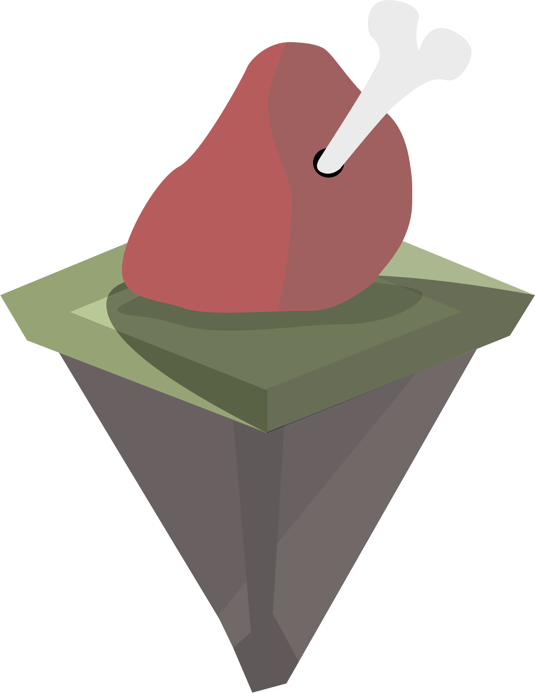

<p align="center">
    
</p>

# Food Chains: Predators, Pack Animals, and Territories (Theme 2)

- [Description](#description)
- [Included input files](#included-input-files)
- [Requirements overview](#requirements-overview)
- [Recommended approach](#recommended-approach)
- [Corrections from the biologist](#corrections-from-the-biologist)

This document contains a description of the second theme of the project.
This document is structured so that:
- **description** gives an insight into what our "mini-world" should be able to support when the theme is completed.
- **Included input files** shows the files the program should be able to load when the theme is completed.
- **Requirements** overview gives an overview of various requirements that need to be supported.
- **Recommended approach** breaks down various requirements and suggests how you can approach the theme from start to finish.

### Description
Nature is becoming even wilder and less idyllic this week. With the addition of wolves and bears, the small rabbits suddenly have two natural enemies **[1]**. This naturally creates uncertainty for the small rabbits, but due to both bears' and wolves' territorial instincts, these animals also hunt and fight each other **[2]**, and other members of their own species. Our little world has developed into a real struggle for survival; do the bears maintain their territories? Which wolf packs survive? Which groups perish?

### Included input files
```
t2-1ab.txt
t2-1c.txt
t2-2a.txt
t2-3a.txt
t2-4a.txt
t2-4b.txt
t2-5a.txt
t2-6a.txt
t2-7a.txt
tf2-1.txt
tf2-2.txt
```
Note about bears in the input file: When bears are mentioned in the input file, they have, in addition to the attributes mentioned in week 1, an (x, y) coordinate indicating the center of their territory. If this is omitted, a random coordinate should be chosen (this is typically if more bears need to be added). See the following example:

```
N Rabbit 10
Bear 1 (3,5)
Bear 5
```

### Requirements overview
When the following requirements are met, theme 2 is completed. Like last week's theme description, all requirements and input files have an ID to help guide you. This week, the requirements are not categorized in the same way as theme 1. It is therefore recommended that you perform an even more stringent object-oriented analysis to start with (see section 4). This week, the requirements are not sorted in a way that necessarily makes sense to implement the first ones first (some of these can be difficult). Therefore, create a comprehensive overview to start with. In addition to the mandatory requirements, voluntary requirements follow at the bottom of the requirements overview.

- **K2-1a**. Wolves can be placed on the map when the input files describe this.
- **K2-1b**. Wolves can die, resulting in their removal from the world.
- **K2-1c**. Wolves hunt other animals and eat them to gain energy.
- **K2-2a**. Wolves are pack animals. They constantly seek out other wolves in their pack. When the input file describes (on a single line) that multiple wolves should be placed, these should automatically be in the same pack.
- **K2-3a**. Wolves and their pack belong to a wolf den, which is also where they reproduce. Wolves 'build' their own dens. If a wolf meets a wolf from another pack, they fight each other.
- **K2-4a**. Bears can be placed on the map when the input files describe this.
- **K2-4b**. Bears, like wolves, hunt and eat everything **[3]**.
- **K2-5a**. Bears are very territorial and do not have a specific place they 'live'. Instead, they attach themselves to a specific area and rarely move out of it. The center of this territory is determined by the bear's starting position on the map.
- **K2-6a**. Bears also eat berries from bushes (such as blueberries and raspberries) when they grow in the area. Berries are a good extra source of nutrition for the bear (although they do not provide the same amount of energy as eating meat), but like bushes, it takes time for the berries to grow back.

### Voluntary, non-mandatory requirements
- **KF2-1**. If one wolf is severely injured, it submits to the winning wolf's pack **[4]**. An injured wolf needs rest before it can continue.
- **KF2-2**. However, bears are not pack animals **[5]** and only meet other bears when they are to mate. Bears can also die and be removed from the world.
- **KF2-3**. Bears that are not ready to mate attack other bears that move into their area. Similarly, they attack other animals.
- **KF2-4**. Bears are naturally our top predators in this small food chain, but it happens that a large enough group of wolves can attack (and kill) a bear. This will in practice be if several wolves from the same pack are near a bear.

### Recommended approach
It is recommended to start this week with an object-oriented analysis by looking at the text, the content of the input files, and the various requirements. This way, you have an overview of what needs to be added. This time, however, we emphasize that there are many opportunities to think about abstract classes, interfaces, and helper classes that can allow you to reuse existing code. For example, you might imagine that you previously implemented code that gives you a placement closer to a target (when you want to move from A to B). This code will likely be used again and can therefore be moved out as a static function in a helper class. Similarly, you might imagine that the actors now to be implemented contain functionality that is the same for all animals you will later implement – how could you concretely reuse this code? Therefore, the first thing you should do is refactor your code before developing the new additions. The considerations regarding refactoring also make sense in this week's diary. It may also make sense to re-evaluate previous tests. Are there any that need to be changed? Should more be made? Many of the requirements this week are more difficult to specify exactly what they mean. It is your task to interpret them and clarify (in the diary) what you have interpreted and why. After that, you can start refactoring the existing code and implementing and testing the new parts. In the course, we mean unit tests as taught. Test continuously as you implement. Here, you can again look at the good advice in the project description if they are too overwhelming to start with. You may subsequently need to investigate further what is available in the World class. Maybe there are things you did not use last week that could be good to use this week.

### Corrections from the biologist
**[1]** In the simulation, these are the natural enemies. In the real world rabbits are often too small for it to be worth it for something like a bear to eat them. Foxes, for example, would be a more "natural" enemy for bears.

**[2]** Such animals would usually avoid each other; it would not pay off for any of them to risk their lives by attacking another top predator. This is something we 'play' with.

**[3]** A biologist would probably describe it as something a bit different from hunting; a bear typically lives on 73% plants, 22% insects, and 5% animals (shows a study of black bears).

**[4]** The fact that wolves switch to a new pack sometimes occurs in nature. Most often, groups will primarily avoid each other. In cases where a fight occurs, the "defeated males" will most often die if they do not manage to escape. The same applies to wandering males.

**[5]** In periods of food abundance, small groups of bears can form; "Bears are solitary by nature, except when in family groups of mothers and cubs or in pairs during the mating season. Bears may congregate in areas of high food density, such as oak stands, berry patches, or farm fields.”


