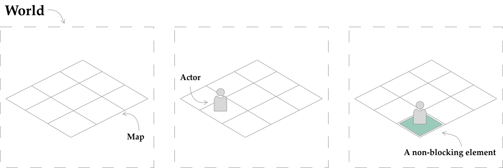
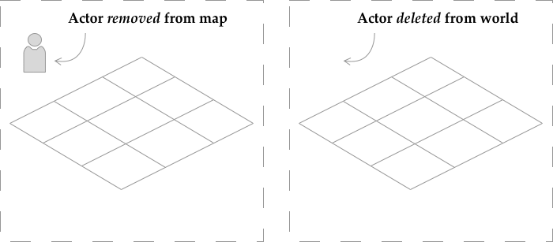
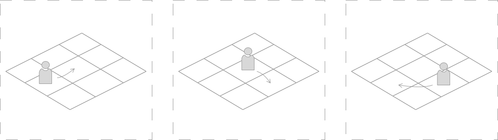
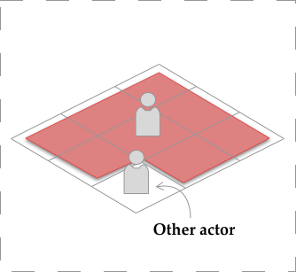
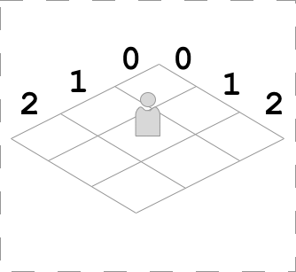
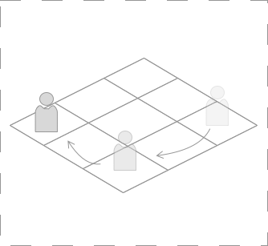
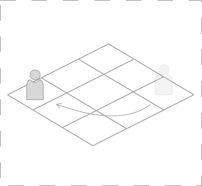

# ITUmulator

Filen her giver en introduktionguide til anvendelse af biblioteket hvori du kommer til at opbygge en lille mini simulation. Forinden giver det mening at gøre dig bekendt med den tilhørende java dokumentation som kan findes [her](https://github.itu.dk/pages/GRPRO-PROJECT/grpro-project/index.html). Der er flere grunde til at vi anvender dette bibliotek. Først og fremmest, så I kan træne at bruge (og lære at forstå) biblioteker, I ikke har brugt før.

<p align="center">
    
</p>

Eksemplet ovenover viser til at starte med to kaniner og en ulv. Eksemplets kode er beskrevet [her](./documentation/gif-example.md).

## Indholdsfortegnelse

- [Bibliotekets opbygning](#bibliotekets-opbygning)
    - [World](#world)
    - [Simulator](#simulator)
    - [Executable](#executable)
    - [Display](#display)
- [Kom i gang guide](#kom-i-gang-guide)
    - [Eksempler](#eksempel-tilfældig-placering-af-personer-og-tilhørende-tests)
        - [Test af eksempel](#test-af-vores-person)
- [Uddybende forklaring: Actor interfacet og metoden act](#uddybende-forklaring-actor-interfacet-og-metoden-act)
    - [Rækkefølge af kald til act](#rækkefølge-af-kald-til-act)
    - [Brug af getSurroundingTiles og den nuværende placering](#brugen-af-getsurroundingtiles-og-den-nuværende-placering)
    - [Flere handlinger i metoden act](#flere-handlinger-i-metoden-act)
- [Anvendelse af DynamicDisplayProvider](#anvendelse-af-dynamicdisplayprovider)

## Bibliotekets opbygning
ITUmulator består af fire pakker; display, executable, simulator, samt World. Det er ikke alle fire pakker, I vil komme til at interagere med (primært **World**), men samlet tillader de os at køre vores simulation. Nedenunder kommer en kort introduktion til deres formål, men der henvises igen til Java dokumentationen for yderligere detaljer. 

### World
*World* vil være den pakke, vi vil arbejde med mest i løbet af projektet. Ved instantiering af en **World** (ud fra en given størrelse) skaber vi en verden bestående af et todimensionelt ’kort’ og yderligere information omkring verden, såsom om det er nat eller dag. Dette illustreres i Figur 1. **World** opererer med klassen *location* som er en abstraktion over et koordinatsæt. Ved brug af disse to ting kan man tilføje diverse aktører (f.eks. dyr, planter og græs) til kortet og verdenen. Dette illustreres i Figur 2. Selvom en **World** er todimensionel, kan vi faktisk have såkaldt ikke-blokerende elementer (dvs elementer, som andre objekter kan placeres ovenpå). Dette er illustreret i Figur 3, hvor det ikke-blokerende element eventuelt kan være græs. Man kan ikke have flere ikke-blokerende elementer oven på hinanden. Alt hvad vi placerer på kortet vil normalt være blokerende og dermed fylde en hel plads.

<p align="center">

</p>

Sidst er det værd at nævne, at der i **World** er stor forskel på at *fjerne* noget og *slette* det. At fjerne noget betyder blot at det ikke længere er på kortet (altså vist i verdenen). Det eksisterer dog stadig i den. Dette vises på Figur 4. Dette betyder bl.a. at aktører som ikke er slettet, stadig agerer i verdenen når simulationen kører. Dette kan f.eks. udnyttes hvis et dyr gemmer sig i en hule, og på et tidspunkt skal beslutte sig for at hoppe ud. At slette noget betyder derimod at det både forsvinder fra kortet og verdenen (objektet holder op med at eksistere), som det forsøges at illustrere på Figur 5.

<p align="center">

</p>

### Simulator
Simulator-pakken sørger for at køre og styre vores simulation (og opdatere den grafiske brugergrænseflade ved behov). Denne pakke vil I for det meste ikke skulle anvende. Dog er det vigtigt at forstå **Actor** interfacet i pakken. For at systemet simulerer objekter, vi tilføjer (altså tillader at de kan agere), skal de implementere **Actor** interfacet. Interfacet består af en enkelt metode act som tager en **World** som parameter. Vi dykker ned i dette interface i startguiden om lidt. 

### Executable
Executable-pakken indeholder tre abstraktioner, der skal gøre det lettere for os at bruge systemet som samlet enhed. Guiden vil introducere disse klasser. Hvis du ønsker dynamisk at ændre udseendet på et objekt undervejs i simulationen (hvilket guidet ikke viser), bør du kigge mod klassen **DynamicDisplayInformationProvider**.

### Display
Display-pakken står for alt det grafiske. Denne vil vi heller ikke dykke ned i, da vi gennem Executable pakken (Program) kan styre de ting vi har brug for. 

# Kom i gang guide
’Kom i gang’-guiden hjælper jer i gang med at anvende biblioteket. Det anbefales således, at alle i gruppen forsøger at følge denne selv. I selve projektet vil I skulle indlæse fra filer. Dog har I set dette flere gange før, og guiden her vil derfor ikke fokusere på dette. I stedet vil guiden fokusere på at tilføje en ’menneskelig’ aktør, der tilfældigt kan bevæge sig rundt i vores verden indtil det bliver nat, hvor vores person simpelthen går hen og ’dør’. Bevægelsen illustreres på den følgende billedserie. Til sidst vil vi beskrive kort hvordan man kan komme i gang med at teste sådanne personer. **Bid mærke i at guiden undervejs har opgaver vi anbefaler i laver**.

<p align="center">

</p>

Første skridt i denne proces, er at instantiere et nyt program i stil med følgende:

```java
int size = 3; // størrelsen af vores 'map' (dette er altid kvadratisk)
int delay = 1000; // forsinkelsen mellem hver skridt af simulationen (i ms)
int display_size = 800; // skærm opløsningen (i px)

Program p = new Program(size, display_size, delay); // opret et nyt program
World World = p.getWorld(); // hiv verdenen ud, som er der hvor vi skal tilføje ting!
```

Hvor du præcist skriver denne kode er op til dig. Du bør dog løbende gøre dig overvejelser (i udviklingsprocessen) om det burde ændres! Det er vigtigt at du her husker at importere de rigtige klasser fra hhv. **Executable** og **World** pakken. Herefter kan vi oprette vores **Person**. Lav derfor en ny klasse med det navn, og sørg for at klassen implementerer **Actor** interfacet fra pakken **Simulator**:

```java
public class Person implements Actor {
    @Override
    public void act(World World) {
        System.out.println("I ain't doin’ nothin’!");
    }   
}
```

Som du kan se, gør klassen ikke andet end at printe ” I ain’t doin’ nothin’!” når metoden kaldes. Vi kan nu gå tilbage til stedet hvor vi har instantieret vores program og tilføje en **person** (husk igen at importere de relevante klasser):
```java
Person person = new Person();
Location place = new Location(0,1); 
World.setTile(place, person);
```
Inden vi kører vores simulation ønsker vi at indstille udseendet på **Person**. Der er her flere muligheder, og vi anbefaler at I undersøger klassen **DisplayInformation** og interfacet **DynamicDisplayInformationProvider** som kan bruges på flere måder til at styre hvordan objekter vises. Du kan her kigge i afsnit 4 hvis du ønsker mere information. Hvis vi ønsker at anvende en rød farve til vores personer kan vi f.eks. registrere det således i programmet:

```java
DisplayInformation di = new DisplayInformation(Color.red);
p.setDisplayInformation(Person.class, di);
```

Her anvender vi standardbiblioteket **awt** til at generere en farve. Man kan naturligvis også angive farver på anden vis (søg her efter *awt.Color*). Derudover understøtter **DisplayInformation** bl.a. også billeder. Den første parameter til metoden *setDisplayInformation* kan se lidt obskur ud. Dette er blot for at fortælle at det er alle instanser af klassen **Person** denne visuelle indstilling gælder for. Udover billeder, kan vi også dynamisk (når programmet køre) opdatere billeder. Her bør du kigge mod **DynamicDisplayInformationProvider** hvis dette er noget du er interesseret i.

Herefter mangler vi blot at vise vores simulation, og køre den:

```java
p.show(); // viser selve simulationen
for (int i = 0; i < 200; i++) {
    p.simulate();
} // kører 200 runder, altså kaldes 'act' 200 gange for alle placerede aktører
```

Når vi når til dette punkt, vil du bide mærke i at der blot printes ”I ain’t doing nothing!” tohundrede gange. Dette er jo i virkeligheden ikke det vi ønsker. Derfor kan vi således vende tilbage til klassen **Person** og implementere den egentlige logik i metoden *act*. Her kan man f.eks. skrive følgende:

```java
Set<Location> neighbours = world.getEmptySurroundingTiles(); 
List<Location> list = new ArrayList<>(neighbours); 
Location l = list.get(0); 
world.move(this,l);
```

Ved at kalde metoden *getEmptySurroundingTiles* returnérer World alle de omkringliggende pladser, som er tomme. Se eksempelvis figuren nedenunder (pladsen vi står på afleveres ikke tilbage):

<p align="center">

</p>

Vi er på nuværende tidspunkt ikke interesseret i de pladser som allerede har noget på sig (det bliver relevant senere). Herefter ønsker vi egentligt blot at tage den første plads der er fri og bevæge os derover. Dette gør vi ved at kalde move med den nye placering. Bid mærke I at vi ikke fortæller **World** noget som helst om hvad der er den nuværende placering, men at vi anvender *this* som parameter, refererer vi til det nuværende objekt, som skal flyttes. (Læs op på diverse metoder der er tilgængelige i klassen **World** der findes mange forskellige brugbare metoder). Grunden til at vi laver sættet om til en liste, er for at kunne udtrække et element ud.

Når du har overskrevet act metoden med den ovenstående metode og kører simulationen, kan du nu se at vores person bevæger sig rundt på kortet. Dog er dette ikke helt tilfældigt, og personer dør ikke endnu, når det bliver nat. Derfor er dine opgaver nu at implementere følgende:

- Anvend **World**s delete metode til at fjerne personer, når det bliver nat.
- Sørg for at lokationen personen bevæger sig over til, er helt tilfældig. Her kan klassen **Random** fra standardbiblioteket hjælpe dig med at give tilfældige tal. Dette kan bruges sammen med listens størrelse til at give en tilfældig lokation.
- Hvad sker der, når der ikke er nogle ledige pladser? Fungerer dit program som forventet. Test dette ved at implementere en JUnit-test

For at løse disse tre opgaver, bør du læse mere om klassen **World**. Her anbefaler vi at du læser den tilhørende Java dokumentation og sætter dig ind i diverse muligheder klassen giver. Det kræver at du har sat dig ind i disse for at arbejde videre. Dertil kan afsnittet senere hen (*Actor interfacet og metoden act*) give dig et bedre indblik i hvad der foregår og hvorfor det virker. 

Nedenfor gennemgår vi nogle andre opgaver sammen. Du bør have lavet de tre ovenstående opgaver inden du går videre.

## Eksempel: Tilfældig placering af personer og tilhørende tests
**Du bør nu tilfældigt placere 10 personer på kortet**. Du skal her også overveje hvad du bør gøre, hvis der allerede er en ting på pladsen. Nedenunder giver vi et bud på hvordan dette kan gøres. Du bør have forsøgt at gøre det selv inden. 

Der er flere måder hvorpå vi tilfældigt kan placere 10 personer i verdenen (specifikt tænker her specifikt på to måder, kan du forklare begge?). Koden skriver vi samme sted, som simuleringen instantieres – faktisk lige før vi kalder *show* metoden. Versionen vi nedfælder herunder, vælger tilfældige placeringer indtil vi har placeret 10 personer. Dette vil naturligvis ikke kunne lade sig gøre hvis der ikke er 10 ledige pladser. Derfor bør du starte med at ændre variablen *size* til at være 15 (dette giver os en verden at størrelsen 15x15, altså med 225 pladser). Det første vi gør, er at instantiere to variable, og lave skabelondelen af vores løkke:

```java
int amount = 10;
Random r = new Random();

for(int i = 0; i < amount; i++){
    // Mere kode kommer her senere.
}
```
Vi erklærer mængden vi gerne vil tilføje (som variabel), og opretter en ny instans af klassen **Random**. Det gør vi, da processen vi nu vil gøre følgende for hver iteration af vores løkke: Tilføj til en tilfældig plads (tilfældigt x og y koordinat):

```java
int amount = 10;
Random r = new Random();

for(int i = 0; i < amount; i++){
    int x = r.nextInt(size);
    int y = r.nextInt(size);
    Location l = new Location(x,y);
    w.setTile(l, new Person());
}
```
Så langt så godt. Vi støder dog her ind i et problem, når vi forsøger, at køre programmet. Det kan nemlig være at vi kommer til at tilføje en person et sted hvor der allerede er en person! I dette tilfælde vil **World** rejse en undtagelse, da dette ikke er tilladt. Derfor bliver vi nødt til at undersøge, om den placering vi vil tilføje en person til, har plads. Hvis ikke der er plads, vil vi prøve med nogle nye tilfældige koordinater. Sådan fortsætter vi indtil vi finder en ledig plads:

```java
for(int i = 0; i < amount; i++){
    int x = r.nextInt(size);
    int y = r.nextInt(size);
    Location l = new Location(x,y);
    // Så længe pladsen ikke er tom, forsøger vi med en ny tilfældig plads:
    while(!w.isTileEmpty(l)) { 
        x = r.nextInt(size);
        y = r.nextInt(size);
        l = new Location(x,y);
    }
    // og herefter kan vi så anvende den:
    world.setTile(l, new Person());
}
```
[ Bonusspørgsmål: Hvad ville der ske, hvis vi ”glemte” at øge size fra 3 (mens amount stadig var 10)? ]

### Test af vores person

Vi sætter her en enkelt test op, der vurderer hvorvidt en person bevæger sig til en ny placering ved kald til act (når det er dag). Her er vores opgave også at sætte en lille verden op, således at vi kan se at personen agerer ordentligt. Når man kommer til mere komplekse krav man skal teste, kan man forestille sig at man skal bruge flere forskellige verdener (til de forskellige tests). For nu, sætter vi dette op i vores BeforeEach. Der er mange måder at teste på, og vi anbefaler at der læses mere om hvilke typer assertions man kan lave med Junit. Herunder viser vi et par stykker. Vi anvender her AAA (*Arrange*, *Act*, *Assert*) teknikken:

```java
public class PersonTest
{
    World w;

    @BeforeEach
    public void setUp()
    {
        w = new World(2); Vi laver blot en verden af størrelsen 2, for simplicitet
    }
... // selve testen kommer her, man bør også have en AfterEach metode, undladt her for simplicitet
}
```
Herefter er vi klar til at lave vores egentlige test. Navngiv dem gerne således at vi kan forstå hvad den tester:
```java
@Test
public void personMovesDuringDay(){
    Person p = new Person(); // Personen vi bruger til at teste
    Location l = new Location(0,0); // Lokationen vi bruger
    w.setDay(); // vi sørger for at det er dag, da dette er vores test case
    w.setCurrentLocation(l); // vi lader som om vi er nået til dette objekt
    w.setTile(l, p); // og placerer personen på lokationen l
        
    p.act(w); // vi eksekverer ’act’ metoden
       
    // Herefter skal vi lave vores check, der er flere forskellige muligheder, vi 
    // giver her et par stykker:
    Location n = w.getLocation(p); // lokationen skal vi bruge...
    assertNull(w.getTile(l)); // vi forventer personen har bevæget sig..
    assertNotNull(n); // altså, at den nye lokation eksisterer
   assertNotEquals(l, n); // og at den gamle og nye lokation ikke er det samme
}
```
Dette er således en test der checker, på forskellige måder, at personen har rykket sig. Nu kan du så med fordel gøre det samme for alle kravene du har implementeret angående en Person. Det kan være, da der muligvis er blevet implementeret andre krav, at den ovenstående test ikke er korrekt i dit program, kan du forstå hvorfor? Bid mærke i at det ovenstående test eksempel anvender setCurrentLocation. Forstår du ikke hvorfor dette gøres,  bør du læse afsnit 4.

Det er utroligt brugbart at lave sådanne tests løbende, da vi på denne måde kan vurdere om vores enkelte aktører gør som forventet i enkelte tilfælde – det kan være svært (og umuligt) at vurdere ved at køre input filer igennem og ’se’ om det hele sker problemfrit og som forventet. Brug derfor unit tests.


Når du har gjort dette, er du mere eller mindre klar til at starte med først uges tema. Du bør dog stadig læse Java dokumentation og sætter dig ind i diverse muligheder **World** klassen giver. **Det er en stor del af det begyndende arbejde**.

# Uddybende forklaring: Actor interfacet og metoden act
**Actor** interfacet kan (måske) virke ligetil når det implementeres første gang. Du modtager *world*, som du kan bruge til at undersøge omgivelserne af selve aktøren, og herefter agere. Dog er der nogle grundlæggende designvalg man bør kende til, for at undgå potentielle problemer i sit program. Måske har du allerede nu stødt på undtagelser såsom IllegalStateException: Currently no location is set. 

**Dette afsnit kræver at du har kendskab til nogle af de forskellige metoder i world, og vi anbefaler derfor at du har fulgt guiden i afsnit 3, inden du læser dette.**

## Rækkefølge af kald til act
*Act* bliver kaldt for alle aktører der er en del af verdenen for hvert ’trin’ i simuleringen. Metoden bliver kaldt for én aktør ad gangen, der er dog ingen garanti for rækkefølgen når selve programmet kører (dette kan man dog sørge for når man tester, hvilket kan være en hjælp for at vurdere om koden opfører sig som forventet). F.eks. kunne rækkefølgen se ud som følger, hvor Ax er individuelle aktører nummereret efter hvornår de er tilføjet til **world**:

<p align="center">

</p>

## Brugen af getSurroundingTiles() og den nuværende placering
**World** indeholder en masse metoder såsom *getSurroundingTiles()* der returnerer alle omkringlæggende felter. Dette er utroligt brugbart hvis vi f.eks. vil rykke vores aktør. Måske har du allerede spurgt dig selv, hvordan ved **world** hvilken placering vi er ved lige nu? **ITUmulator** er implementeret således, at lige før *act* metoden bliver kaldt, for en aktør, så opdateres den nuværende placering således at du kan bruge metoder såsom *getSurroundingTiles()* uden at specificere hvilken lokation du vil have de omkringliggende felter for. Det er vigtigt at forstå, at denne placering ikke bliver opdateret i løbet af din *act* metode medmindre du selv gør dette. F.eks. kan man forestille sig at vi har en aktør, i en lille verden (placeret på 1,1):
 
<p align="center">

</p>

Når *act* bliver kaldt for aktøren, og vi anvender metoder såsom *getSurroundingTiles()*, vil **world** automatisk vide, at placering vi ønsker de omkringliggende felter for er 1,1. Kalder vi *move(…)* for at rykke vores aktør til feltet 0,0, og kalder *getSurroundingTiles()* igen, sker der noget (måske) uventet. Prøv at kør følgende kode (i din *act* metode):

```java
System.out.println("Første lokationer:");
Set<Location> locations1 = world.getSurroundingTiles();
System.out.println(locations1);
world.move(this, new Location(0,0));
System.out.println("Andre lokationer:");
Set<Location> locations2 = world.getSurroundingTiles();
System.out.println(locations2);
```
Ved at anvende følgende kode (med en aktør på plads 1,1 til at starte med), finder vi ud af, at begge set af lokationer er de samme. Dette er intentionelt, da vi ikke har opdateret den placering som **world** bruger når vi kalder *getSurroundingTIles()*. Denne bliver jo kun opdateret lige *inden* kaldet til *act*. Ønsker vi i stedet at få de omkringliggende lokationer ud fra den nye position, har vi to muligheder. Vi kan opdatere den lokation som **world** bruger til disse metoder (dette gøres ved at kalde *setCurrentLocation(…)* med den nye placering), eller vi kan anvende *getSurroundingTiles(…)* metoden der tager en lokation som parameter. Det er her valgfrit hvad man gør, man skal dog være opmærksom på, at ved brug af *setCurrentLocation(…)* vi alle metoder der bruger den ’nuværende’ lokation bruge denne nye placering. Her henviser vi til java dokumentation hvor du kan se, hvilke metoder der anvender denne. Altså kunne det se ud som følger:

```java
System.out.println("Første lokationer:");
Set<Location> locations1 = world.getSurroundingTiles();
System.out.println(locations1);
world.move(this, new Location(0,0));
world.setCurrentLocation(new Location(0,0)); // opdatering af placering
System.out.println("Andre lokationer:");
Set<Location> locations2 = world.getSurroundingTiles();
System.out.println(locations2);
```

Dette er også grunden til at vi i test eksemplet i afsnit 3, anvender *setCurrentLocation(…)* inden vi kalder *act*. Ellers ved world ikke hvilken placering der er tale om til at starte med. Ved kørsel af selve programmet, står **ITUmulator** for at opdatere den nuværende lokation, inden *act* køres. 

Netop det faktum at den nuværende lokation kun bliver sat lige inden kaldet til act (medmindre vi senere gør det selv) er også grunden til at vi støder på undtagelser såsom **IllegalStateException**. Forestil dig at du har en aktør, som ikke har en placering på kortet, men eksisterer i verdenen. Når denne aktørs *act* metode bliver kaldt, vil der ikke være en placering (kalder du *getCurrentLocation()* vil denne således returnere **null**). Selvom du så senere i programmet anvender *setTile(…)* for at give aktøren en placering, kan du ikke blot anvende *getSurroundingTiles()* da **world** ikke ved at dette er sket. For at eksemplificere dette, forestiller vi os, at vi har tilføjet en aktør til vores verden (ved brug af *add(…)*) og kalder *act* som ser ud som følger:

```java
world.setTile(new Location(0,0), this);
Set<Location> locations = world.getSurroundingTiles();
System.out.println(locations);
```

Programmet vil her aldrig nå til linje 3, da der bliver kastet en **IllegalStateException** på linje 2. Vi kan blot løse dette, ved at opdatere world således at den er klar over, at vi nu har en placering:

```java
world.setTile(new Location(0,0), this);
world.setCurrentLocation(new Location(0,0)); // Opdatering af nuværende placering
Set<Location> locations = world.getSurroundingTiles();
System.out.println(locations);
```

Ved at tilføje linje 2, vil programmet ikke længere kaste denne fejl. Det er således vores ansvar at opdatere **world** (eller bruge de metoder som ikke anvender den nuværende placering) når vi ændrer placering (dette er også tilfældet hvis vi f.eks. anvender *remove(...)*). 

Et beslægtet, men ikke identisk problem, forekommer hvis vi f.eks. forsøger at slette aktøren fra verdenen (med følgende kode i act):

```java
if(age > 10) world.delete(this); // vi forestiller os, at aktøren har en alder som felt
Location l = world.getLocation(this);
System.out.println(l);
age++;
```

Her forestiller vi os, at en aktør dør, hvis den har en alder over ti. Hvis ikke, ønsker vi blot at printe dens placering og øge dens alder. Når aktøren når alderen 11, kaldes delete. Her vil undtagelsen "**IllegalArgumentException**: *Object does not exist in the world*" opstå. Dette sker da java programmer fortsætter med at køre linje 2-4, selvom vi har kaldt *delete(…)*. Dette fejler, da vi jo ikke længere kan få aktørens nuværende placering, da den ikke eksisterer længere. Du kan undgå dette, ved 1) at returnere efter kaldet til *delete*, eller 2) rykke *delete* statementet ned som det sidste. 

## Flere handlinger i metoden act
Til sidst, kan det være at vi har stødt på et problem såsom at når vi kører vores simulation, så bevæger aktøren sig mere end vi havde forventet, eller måske skulle aktøren bevæge sig før den forsvinder, men det ser ud som om aktøren bare bliver fjernet. 

Dette er fordi, at brugergrænsefladen kun visualiserer én handling for hver gang metoden *act* kaldes. Man kunne således forestille sig at vi i *act* metoden af en aktør, rykker den tre gange. F.eks. rykkes aktøren på illustrationen nedenunder, fra højre mod venstre:

<p align="center">

</p>

Dette kunne f.eks. ske i en løkke, eller blot ved at kalde *move(…)* to gange (hvor aktøren starter på placeringen 0,2:

```java
world.move(this, new Location(2,2));
world.move(this, new Location(0, 2));
```

Resultatet, når vi trykker ‘step’ i programmet, er dog at vi ser følgende:

<p align="center">

</p>

Ønsker vi således at animere alle trinene, bliver vi nødt til at sørge for vi kun rykker aktøren én gang, hver gang metoden *act* køres. Dette gør sig også gældende, hvis en aktør f.eks. først rykker hen på et felt, og herefter bliver fjernet fra verdenen (i et kald til *act*). Her vil vi ikke se at aktøren rykker sig, kun at den forsvinder.

Konsekvensen af denne form for animering, er også, at når en aktør rykker sig og efterfølgendebliver fjernet fra verdenen / erstattet af noget andet, animeres sletningen kun. Tester man ved brug af unit tests kan man dog se, at aktørerne opfører sig som forventet, selvom dette ikke vises korrekt.

# Anvendelse af DynamicDisplayProvider

Hvis man vil have mere frihed i de grafiske visningsmuligheder, kan man tage et kig på **DisplayInformation** og **DynamicDisplayProvider**. En aktør kan vises med et billede (**BufferedImage**/**Image**) eller en farve (**Color**). 

Programmet indlæser automatisk alle **.png**, **.jpeg** og **.jpg** filer som ligger i resources mappen som er sidestillet med **src** mappen i projektet. Et billede skal have et unikt navn da de automatisk bliver indlæst med deres filnavn (ergo kan man ikke have “*person.png*” og “*ny-mappe/person.png*”).

Hvis man har tilføjet et billede i resources mappen kan det anvendes ved at lave en ny **DisplayInformation** med den mere avancerede konstruktør således:

```java
DisplayInformation di = new DisplayInformation(Color.red, “person”);
p.setDisplayInformation(Person.class, di);
```

Dermed anvendes “*person.png*” de steder hvor billeder kan anvendes. Den vil automatisk blive skaleret så godt som muligt. Det er underordnet hvilken sub-mappe “*person.png*” ligger i indenfor *resources* mappen. Kan billedet ikke bruges, anvendes farven. 

**DynamicDisplayProvider** er en udvidelse du kan anvende hvis du på runtime (mens programmet kører) vil skifte billedet (f.eks. for at indikere forskellig opførsel). Denne del er ikke nødvendig for at gennemføre projektet, men kan give mere kreativ frihed. Man kan også med fordel bruge egne ikoner. Du skal her blot implementere interfacet **DynamicDisplayProvider** i din aktør, og dermed implementere metoden *getInformation()*. Denne metode bliver kaldt hver gang din aktør kan tegnes, så du kan altså her returnere en ny **DisplayInformation** som dermed kan ændre farven/billedet du viser. Et eksempel kunne være at man (når en person sover om natten) vil anvende en farve og når personen er vågen en anden farve. Der er flere måder at gøre dette på, og eksemplet her er blot en af mange.

For at sørge for at vores metode *getInformation()* returnerer en **DisplayInformation** med den rigtige farve, afhængigt af om det er dag eller nat, bliver vi nødt til at opbevare information om dag/nat et sted, da metoden ikke har adgang til **World**! Derfor tilføjer vi et felt i klassen **Person**:

```java
boolean isNight = false;
```

Så kan vi opdatere denne når **act(…)** metoden kaldes:

```java
@Override
public void act(World world) {
...
        isNight = world.isNight();
...
}
```

Nu ved vi, at hver gang *getInformation()* bliver kaldt, vil vi kunne anvende værdien af feltet *isNight* til at ændre hvilken farve en **Person** har (f.eks. for at indikere at personen sover). Det gør vi ved at returnere en **DisplayInformation** med forskellige farver:

```java
@Override
public DisplayInformation getInformation() {
    if (isNight){
       return new DisplayInformation(Color.BLUE);
    } else {
       return new DisplayInformation(Color.GRAY);
    }
}
```

Ved brug af dette interface kan du således styre billedet / farven afhængigt af forskellige felter i klassen, f.eks. hvor sulten, stor, eller stærk en aktør er. De nævnte ting er blot eksempler. Husk at anvendelsen af **DynamicDisplayInformationProvider** ikke er et krav. Implementerer et objekt i **World** dette interface overskrider det alle andre regler for farve / billede man må have indstillet andet steds. 
