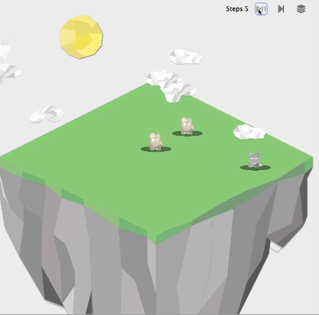

# WorldSimulator (Some components still labelled ITUmulator)

*All files in this repository has been machine translated from its original and may therefore contain errors (originally in Danish). Further, the majority of the formatting is lost due to the markdown format of github.*

If you are a teacher looking to adapt the project in parts or its entirety, please check the markdown file [here](./teachers/readme.md).
The source code for the library can be found [here](./src/) and its documentation online [here](https://sebastiannicolajsen.github.io/WorldSimulator/) or as files [here](./documentation/). The project description and related themes as executed the first time can be found [here](./project/).


# Introduction guide

This file provides an introductory guide to using the library in which you will build a small mini-simulation. Before that, it makes sense to familiarize yourself with the accompanying Java documentation, which can be found [here](https://sebastiannicolajsen.github.io/WorldSimulator/). There are several reasons why we use this library. First and foremost, so you can practice using (and learn to understand) libraries you haven't used before.

<p align="center">
    
</p>


The example above initially shows two rabbits and a wolf. The example code is described [here](./documentation/gif-example.md).

## Table of Contents
- [Library Structure](#library-structure)
- [World](#world)
- [Simulator](#simulator)
- [Executable](#executable)
- [Display](#display)
- [Getting Started Guide](#getting-started-guide)
- [Examples](#example-random-placement-of-people-and-associated-tests)
- [Testing Example](#testing-our-person)
- [Detailed Explanation: Actor Interface and Method act](#detailed-explanation-actor-interface-and-method-act)
- [Order of Calls to act](#order-of-calls-to-act)
- [Using getSurroundingTiles and Current Location](#using-getsurroundingtiles-and-current-location)
- [Multiple Actions in Method act](#multiple-actions-in-method-act)
- [Using DynamicDisplayProvider](#using-dynamicdisplayprovider)

## Library Structure
ITUmulator consists of four packages: display, executable, simulator, and World. Not all four packages will be interacted with (primarily **World**), but collectively they allow us to run our simulation. Below is a brief introduction to their purposes, but refer again to the Java documentation for further details.

### World
*World* will be the package we will work with most during the project. By instantiating a **World** (based on a given size), we create a world consisting of a two-dimensional 'map' and additional information about the world, such as whether it is night or day. This is illustrated in Figure 1. **World** operates with the class *location*, which is an abstraction over a coordinate set. Using these two things, various actors (e.g., animals, plants, and grass) can be added to the map and the world. This is illustrated in Figure 2. Although a **World** is two-dimensional, we can actually have so-called non-blocking elements (i.e., elements that other objects can be placed on top of). This is illustrated in Figure 3, where the non-blocking element could be grass. You cannot have multiple non-blocking elements stacked on top of each other. Everything we place on the map will normally be blocking and thus occupy an entire space.

Lastly, it is worth mentioning that there is a significant difference in **World** between *removing* something and *deleting* it. Removing something simply means it is no longer on the map (i.e., shown in the world). However, it still exists in it. This is shown in Figure 4. This means that actors that are not deleted still act in the world when the simulation runs. This can be exploited if an animal hides in a cave and at some point decides to jump out. Deleting something means that it disappears from both the map and the world (the object ceases to exist), as illustrated in Figure 5.

### Simulator
The simulator package is responsible for running and managing our simulation (and updating the graphical user interface as needed). You will mostly not need to use this package. However, it is important to understand the **Actor** interface within it. For the system to simulate objects we add (i.e., allow them to act), they must implement the **Actor** interface. The interface consists of a single method act that takes a **World** as a parameter. We will delve into this interface shortly in the getting started guide.

### Executable
The executable package contains three abstractions designed to make it easier for us to use the system as a whole. The guide will introduce these classes. If you want to dynamically change the appearance of an object during simulation (which this guide does not show), you should look at the class **DynamicDisplayInformationProvider**.

### Display
The display package handles all graphical aspects. We will not dive into this either since we can control what we need through the executable package (Program).

## Getting Started Guide
The 'Getting Started' guide helps you begin using the library. It is recommended that everyone in your group tries to follow this themselves. In the project itself, you will need to load from files. However, you have seen this several times before, so this guide will not focus on that. Instead, it will focus on adding a 'human' actor that can randomly move around in our world until it becomes night when our person simply goes and 'dies'. The movement is illustrated in the following series of images. Finally, we will briefly describe how to start testing such persons.

**Note that there are tasks recommended throughout this guide for you to complete**.

The first step in this process is to instantiate a new program like this:

```java
int size = 3; // size of our 'map' (this is always square)
int delay = 1000; // delay between each step of the simulation (in ms)
int display_size = 800; // screen resolution (in px)
Program p = new Program(size, display_size, delay); // create a new program
World world = p.getWorld(); // get the world out where we will add things!
```

Where you write this code precisely is up to you. However, you should continuously consider (during development) whether it should be changed! It is important here that you remember to import the correct classes from both **Executable** and **World** packages.

Next, we can create our **Person**. Therefore, create a new class with that name and ensure that it implements the **Actor** interface from the **Simulator** package:

```java
public class Person implements Actor {
    @Override
    public void act(World world) {
        System.out.println("I ain't doin’ nothin’!");
    }
}
```

As you can see, this class does nothing more than print "I ain't doin’ nothin’!" when the method is called.

Now we can go back to where we instantiated our program and add a **person** (again remember to import relevant classes):

```java
Person person = new Person();
Location place = new Location(0, 1);
world.setTile(place, person);
```

Before running our simulation, we want to set up how our **Person** looks. There are several options here, and we recommend investigating the class **DisplayInformation** and interface **DynamicDisplayInformationProvider**, which can be used in various ways to control how objects are displayed. You can refer to section 4 if you want more information.

If we want our persons to use a red color, for example, we could register it like this in the program:

```java
DisplayInformation di = new DisplayInformation(Color.red);
p.setDisplayInformation(Person.class, di);
```

Here we use the standard library **awt** to generate a color. Naturally, colors can also be specified in other ways (search here for *awt.Color*). Additionally, **DisplayInformation** also supports images among other things. The first parameter for the method *setDisplayInformation* may seem obscure; it's just meant to indicate that this visual setting applies to all instances of class **Person**.

In addition to images, we can also dynamically update images while the program runs; here you should look at **DynamicDisplayInformationProvider** if that's something you're interested in.

Next, we just need to show our simulation and run it:

```java
p.show(); // shows the simulation
for (int i = 0; i < 200; i++) {
    p.simulate(); // runs 200 rounds; 'act' is called 200 times for all placed actors
}
```

At this point, you'll notice that "I ain't doin’ nothin’!" gets printed two hundred times. This isn't really what we want. Therefore, we can return to class **Person** and implement actual logic in method *act*. Here one might write:

```java
Set<Location> freeLocations = world.getSurroundingTiles(this);
```

We are currently not interested in places that already have something on them (that becomes relevant later). We simply want to take the first free spot available and move there by calling move with the new location.

Note that by not telling **World** anything about what its current location is but using *this* as a parameter refers us back to the current object that should be moved (read up on various methods available in class **World**, as there are many useful methods). The reason for converting the set into a list is so we can extract an element from it.

Once you've overridden method act with this method above and run your simulation again, you'll see that our person moves around on the map. However, this isn't entirely random yet; persons don't die when night falls either.

Therefore your tasks now are:
- Use **World's** delete method to remove persons when night falls.
- Ensure that the location where persons move next is completely random; here class **Random** from standard library can help give random numbers.
- What happens when there are no available spaces? Does your program behave as expected? Test this by implementing a JUnit test.

To solve these three tasks, you should read more about class **World**. We recommend reading its associated Java documentation and familiarizing yourself with various options provided by this class; understanding these is essential for moving forward.

Additionally, section later (*Actor interface and method act*) will give you better insight into what happens and why it works.

Below we go through some other tasks together; you should have completed those three tasks before moving on.

## Example: Random Placement of Persons and Associated Tests

**You should now randomly place 10 persons on the map**. You should also consider what you should do if there’s already something at that spot.

Below we provide one way this could be done; however, you should have tried doing it yourself first.

There are several ways we can randomly place 10 persons in the world (specifically thinking about two ways here; can you explain both?). The code we'll write goes right where we instantiate simulation—actually just before calling *show* method.

The version we'll write below randomly chooses placements until we've placed 10 persons:

```java
int amount = 10;
Random r = new Random();
for(int i = 0; i < amount; i++){
    // More code comes here later.
}
```

We declare how many we'd like to add (as variable) and create a new instance of class **Random** because during each iteration of our loop we'll do as follows: Add at some random spot (random x and y coordinates):

```java
int amount = 10;
Random r = new Random();
for(int i = 0; i < amount; i++){
    int x = r.nextInt(size);
    int y = r.nextInt(size);
    Location l = new Location(x,y);
    w.setTile(l, new Person());
}
```

So far so good! However, we're encountering an issue when trying to run our program because it's possible we'll try adding a person where one already exists! In such cases, **World** raises an exception since that's not allowed.

Thus we'll need to check if there's space at our intended location before adding a person there; if not available we'll try some new random coordinates until we find an open spot:

```java
for(int i = 0; i < amount; i++){
    int x = r.nextInt(size);
    int y = r.nextInt(size);
    Location l = new Location(x,y);
    
    // As long as space isn't empty we'll attempt another random spot:
    while(!w.isTileEmpty(l)) {
        x = r.nextInt(size);
        y = r.nextInt(size);
        l = new Location(x,y);
    }
    
    // And then we can use it:
    world.setTile(l, new Person());
}
```

[Bonus question: What would happen if we "forgot" to increase size from 3 while amount was still set at 10?]

### Testing Our Person

We set up here a simple test assessing whether a person moves correctly upon being called act (when it's day). Our task here also involves setting up a small world so we can see if person acts properly.

When facing more complex requirements needing testing one might imagine needing several different worlds (for different tests). For now though let's set this up within our BeforeEach method.

There are many ways of testing available; reading more about types of assertions one can make with Junit is recommended.

Below are some examples using AAA (*Arrange*, *Act*, *Assert*) technique:

```java
public class PersonTest {
    World w;

    @BeforeEach
    public void setUp() {
        w = new World(2); // We simply create a world of size 2 for simplicity.
    }

    ... // actual test comes here; one should also have an AfterEach method omitted here for simplicity.
}
```

Now we're ready for our actual test! Name them such that it's clear what they assess:

```java
@Test
public void personMovesDuringDay(){
    Person p = new Person(); // The person we're using for testing.
    Location l = new Location(0,0); // The location we're using.
    
    w.setDay(); // Ensure it's day since that's our test case.
    w.setCurrentLocation(l); // Pretend we've reached this object.
    w.setTile(l,p); // Place person at location l.
    
    p.act(w); // Execute 'act' method.
    
    // Now let's make our checks; there are various options available:
    
    Location n = w.getLocation(p); // We'll need location...
    
    assertNull(w.getTile(l)); // Expecting person has moved...
    assertNotNull(n); // Thus ensuring new location exists.
    assertNotEquals(l,n); // And old/new locations aren't same.
}
```

This test checks through various means whether person has moved successfully! Now ideally you'd replicate similar tests for all requirements you've implemented concerning Person.

It may be possible due other requirements implemented that above test doesn't hold true within your program—can you understand why?

Note that above test example uses setCurrentLocation—if you're unclear why that's done read section 4! 

It’s incredibly useful performing such tests regularly since they allow us assessing whether individual actors behave as expected under specific circumstances—it may become difficult (or impossible) evaluating behavior without them!
